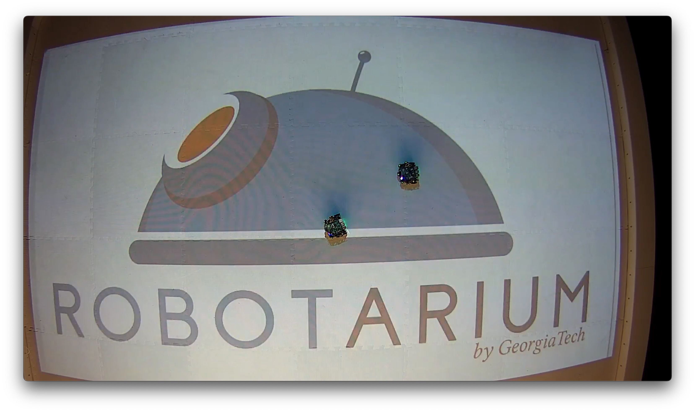

# Robotarium Nurse Patient Experiment

Remote swarm robotics experiments conducted on Georgia Tech's Robotarium platform using GRITSBot robots.

<picture>
  
</picture>

## Overview

This repository contains Python scripts and documentation for experiments run on the [Georgia Tech Robotarium](https://www.robotarium.gatech.edu/) - a remotely accessible, $2.5 million swarm robotics research platform funded by the National Science Foundation (NSF) and Office of Naval Research.

## Experiments

### Trial_01_29Jan26 - Clinical Trial Nurse-Patient Simulation
- **Duration:** 60 seconds
- **Robots:** 2 GRITSBot units
- **Description:** Original trial simulating clinical trial interactions between nurse and patient robots
- **Status:** ✅ Completed (January 30, 2026)

📹 **Video:** [Watch Experiment on Google Drive](YOUR_GOOGLE_DRIVE_LINK_HERE)

### Demo - GT Circle Formation
- **Description:** Robotarium demonstration showing robots forming the Georgia Tech logo pattern
- **Source:** [Robotarium Demo Page](https://www.robotarium.gatech.edu/demo)

📹 **Video:** [Watch Demo on Google Drive](YOUR_GOOGLE_DRIVE_LINK_HERE)

## Hardware Platform

The experiments utilize **GRITSBot** robots - custom miniature differential-drive robots developed by Georgia Tech's GRITS Lab.

### GRITSBot Specifications

| Component | Specification |
|-----------|---------------|
| **Main Processor** | ESP8266 (80/160 MHz, ~80kB DRAM, ~35kB IRAM) |
| **Motor Controller** | Atmega168/328 (8MHz, 16/32 KB flash, 2 KB RAM) |
| **WiFi** | IEEE 802.11 B/G/N (built into ESP8266) |
| **Motors** | Miniature stepper motors with high-resolution control |
| **Power** | LiPo battery with Qi wireless charging |
| **Sensors** | IR distance sensing, current/voltage monitoring |
| **Tracking** | Overhead camera system for global positioning |

### Main Board Components
- ESP8266 12-E with 4MB flash memory (OTA firmware updates)
- MCP73831 LiPo battery charging chip
- AP2112K-3.3V voltage regulator (600mA capacity)
- MCP1640 step-up converter for motors
- INA219 I2C current/voltage sensor
- ATECC108 encryption chip

### Motor Board Components
- Atmega168/328 microcontroller
- Two LB1836M motor drivers
- QRE1113 infrared line sensors
- STLM20 temperature sensors
- ZXCT1009 current sensors

For complete hardware documentation, see: [GRITSBot Hardware Design](https://github.com/robotarium/GRITSBot_hardware_design)

## Robotarium Platform

The Robotarium is a 725-square-foot facility housing nearly 100 rolling and flying swarm robots accessible to researchers worldwide.

### Key Features
- **Arena:** 12' x 14' white surface with integrated charging slots
- **Tracking:** Motion capture cameras for precise robot positioning
- **Charging:** 76 slots with 152 wireless charging cells
- **Safety:** Barrier certificates prevent robot collisions
- **Access:** Remote experiment submission via web interface

### Resources
- **Main Site:** https://www.robotarium.gatech.edu/
- **Demo Page:** https://www.robotarium.gatech.edu/demo
- **Python Simulator:** https://github.com/robotarium/robotarium_python_simulator
- **MATLAB Simulator:** https://github.com/robotarium/robotarium-matlab-simulator

## Repository Structure
## Running Experiments

### Prerequisites
- Python 3.5+
- NumPy, matplotlib, CVXOPT
- Robotarium Python Simulator (for local testing)

### Local Simulation
```bash
# Clone the Robotarium simulator
git clone https://github.com/robotarium/robotarium_python_simulator.git
cd robotarium_python_simulator
pip install .

# Run your experiment locally
python experiments/Trial_01_29Jan26/main.py
```

### Submitting to Robotarium
1. Go to https://www.robotarium.gatech.edu/experiment
2. Create account and log in
3. Fill in experiment parameters (title, duration, robot count)
4. Upload `main.py`
5. Submit and wait for execution
6. Receive video and log files via email/web interface

## References

1. Pickem, D., Lee, M., & Egerstedt, M. (2015). "The GRITSBot in its Natural Habitat – A Multi-Robot Testbed." IEEE ICRA 2015.

2. Wilson, S., et al. (2020). "The Robotarium: Globally impactful opportunities, challenges, and lessons learned in remote-access, distributed control of multirobot systems." IEEE Control Systems Magazine, 40(1):26–44.

3. Pickem, D., Glotfelter, P., Wang, L., et al. (2017). "The Robotarium: A remotely accessible swarm robotics research testbed." IEEE ICRA 2017.

## Acknowledgments

- Georgia Tech GRITS Lab
- National Science Foundation (Grants #1531195, #1544332)
- U.S. Office of Naval Research (Grant N00014-17-1-2323)

## License

This project is for educational and research purposes. See individual experiment directories for specific licensing.

## Contact

- **GitHub:** [kevinkawchak](https://github.com/kevinkawchak)
- **Robotarium Support:** https://www.robotarium.gatech.edu/
