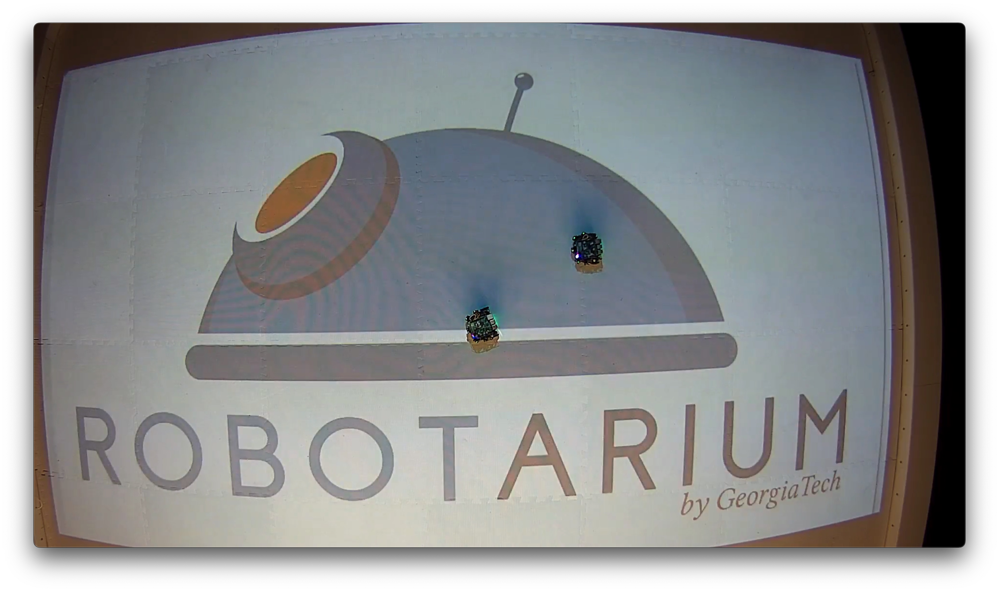

# Robotarium Nurse Patient Experiment

[**Run the Web Simulator**](https://kevinkawchak.github.io/robotarium-nurse-patient-study/) — select 2-robot or 14-robot experiment, press Play (no install required)

[10Runs_11Jun26](../master/10Runs_11Jun26)


### Run Catalog

| Run | Script | Algorithm pattern | D/N/P | Robots | Duration | Clinical objective |
|-----|--------|-------------------|-------|--------|----------|--------------------|
| 01 | `Run01_SwarmIntake_11Jun26.py` | Boids flocking + shepherding | 2/4/8 | 14 | 150 s | Cohort intake crowd-flow |
| 02 | `Run02_GeneticPairing_11Jun26.py` | Genetic algorithm | 3/5/8 | 16 | 180 s | Care-team assignment |
| 03 | `Run03_DifferentialWard_11Jun26.py` | Differential evolution | 4/4/8 | 16 | 210 s | Ward layout (facility location) |
| 04 | `Run04_PSODoseSearch_11Jun26.py` | Particle swarm optimization | 2/3/5 | 10 | 150 s | Dose-response optimum search |
| 05 | `Run05_AntColonyMeds_11Jun26.py` | Ant colony optimization | 1/4/6 | 11 | 195 s | Medication delivery rounds |
| 06 | `Run06_ConsensusVitals_11Jun26.py` | Delta-disk graph consensus | 3/4/9 | 16 | 165 s | Vitals reconciliation via ferrying |
| 07 | `Run07_AuctionTriage_11Jun26.py` | Market-based auctions | 2/5/9 | 16 | 240 s | Triage pipeline throughput |
| 08 | `Run08_PotentialIsolation_11Jun26.py` | Artificial potential fields | 3/3/6 | 12 | 180 s | Infection-control isolation |
| 09 | `Run09_AnnealingBeds_11Jun26.py` | Simulated annealing | 2/4/7 | 13 | 165 s | Bed reassignment optimization |
| 10 | `Run10_ConvoyDischarge_11Jun26.py` | Leader-follower convoys | 1/3/6 | 10 | 210 s | Discharge logistics |

Every script documents a step-by-step expected-time bullet timeline, the emergent behaviors it demonstrates (with live printed metrics: flock polarization, GA churn, DE station drift, PSO basin escapes, pheromone tour concentration, consensus spread, auction load balance, cell-capture conflicts, annealing energy traces, convoy string stability), and a Robotarium compliance block.

📹 **New Video 13Feb26:** [14 Robot Doctor/Patient Swarm Interactions](https://drive.google.com/file/d/1M97IHiHEKnU3FW8gpx3g1sJBNsatAUEp/view?usp=drivesdk)

---

<picture>
  
</picture>

Overview

This repository contains Python scripts and documentation for experiments run on the [Georgia Tech Robotarium](https://www.robotarium.gatech.edu/) - a remotely accessible, $2.5 million swarm robotics research platform funded by the National Science Foundation (NSF) and Office of Naval Research.


## v0.4.0 - 10Runs_11Jun26: Ten-Algorithm Doctor/Nurse/Patient Suite

Ten new standalone Robotarium experiments in [`10Runs_11Jun26/`](10Runs_11Jun26/). Each run casts the fleet as a unique mix of **doctors / nurses / patients**, drives a different **algorithm family** against a different **clinical-trial objective**, and tracks every role with a coherent **LED state machine** that updates throughout the real run (doctors blue, nurses green/violet, patients red-amber-green by state). 


### Diagram 0 - 10Runs_11Jun26 Suite Architecture

```text
+--------------------------------------------------------------------------+
| Run01..Run10 (standalone Robotarium scripts, 10-16 robots each)          |
|   timeline: 15 s STANDBY (LED system check + role announce)              |
|             -> algorithm phases (swarm / GA / DE / PSO / ACO /           |
|                consensus / auction / fields / annealing / convoys)       |
|             -> hold + LED completion display                             |
+-------------------------------+------------------------------------------+
                                |
                                v
+--------------------------------------------------------------------------+
| Shared compliance core (embedded in every script)                        |
|   rps API resolver (server short-form <-> repo-stub long-form names)     |
|   SI barrier certificates w/ boundary  | zero-velocity spin guard        |
|   derated caps 0.14 m/s / 1.8 rad/s    | wheel-speed budget rescaling    |
|   LED shim (set_left/right_leds or fork LED array, 0-255 RGB)            |
|   white arena/figure background        | start spacing >= 0.36 m asserts |
|   call_at_scripts_end() + debug() end hooks                              |
+-------------------------------+------------------------------------------+
                                |
            +-------------------+-------------------+
            v                                       v
+---------------------------+        +----------------------------------+
| GTERNAL fork simulator    |        | Robotarium production server     |
| (robotarium_python_sim)   |        | (real GRITSBot / GTERNAL fleet)  |
| init-drive phase + QP     |        | 15 s standby covers fleet start; |
| barriers + validator:     |        | LEDs track roles live; arena     |
| "No errors or warnings"   |        | white; <= 600 s runtime          |
+---------------------------+        +----------------------------------+
```

### Repository Structure

```text
robotarium-nurse-patient-study/
├── 10Runs_11Jun26/            # v0.4.0: ten-algorithm doctor/nurse/patient suite
│   ├── Run01_SwarmIntake_11Jun26.py        ... Run10_ConvoyDischarge_11Jun26.py
├── Exp_01a_12Feb26.py         # 14-robot doctor-patient swarm (CI smoke test)
├── Exp_02_30Apr26.py          # real-time 16-robot swarm variants
├── Exp_02b_30Apr26.py
├── Exp_02c_30Apr26.py         # production-server API-name hardened variant
├── main.py                    # original 2-robot nurse-patient trial (CI smoke test)
├── rps/                       # bundled Robotarium-compatible simulator stub
│   └── utilities/             # controllers, barriers, transformations, misc
├── docs/                      # GitHub Pages web simulator + design docs
├── releases/                  # versioned release notes (v0.2.0 ... v0.4.0)
├── assets/                    # images
├── changelog.md
├── pyproject.toml             # ruff lint/format configuration
└── requirements.txt
```

### Pre-flight the suite locally

```bash
# Fast, headless verification against the bundled rps stub (repo root):
RNPS_FAST_SIM=1 python 10Runs_11Jun26/Run01_SwarmIntake_11Jun26.py

# Full-fidelity verification against the official simulator fork
# (initialization drive phase + QP barrier certificates + validator):
PYTHONPATH=/path/to/fork_robotarium_python_simulator \
  MPLBACKEND=Agg RNPS_FAST_SIM=1 python 10Runs_11Jun26/Run04_PSODoseSearch_11Jun26.py
```

`RNPS_FAST_SIM=1` disables real-time throttling and the figure for local pre-flight; the Robotarium server never sets it and runs the full real-time script unchanged.

## v0.3.1 Simulator (Dual-Experiment Support + CI Hardening)

This repository includes a built-in Robotarium-compatible simulator with full API parity against the official `robotarium_python_simulator`:
- **In browser (GitHub Pages v3.1, iOS-friendly):** select an experiment from the dropdown or upload/drag a `.py` file and press **Play** — heading arrows, motion trails, phase timeline, speed controls
- **Locally in Python:** run experiment files directly with only NumPy (pre-flight verification before Robotarium submission)

### Diagram 1 — Simulator Architecture

```text
+─────────────────────────────+      +─────────────────────────────────────+
| User .py experiment script  | ---> | Robotarium API Compatibility (rps/) |
|  Exp_01a_12Feb26 (14-robot) |      |  - Robotarium class (velocity lims) |
|  main.py (2-robot nurse)    |      |  - SI + CLF unicycle controllers    |
+─────────────────────────────+      |  - SI + Uni barrier certificates    |
                                     |  - SI <-> Uni transformations       |
                                     |  - Graph Laplacians, convergence    |
                                     +─────────────────┬───────────────────+
                                                       |
                                                       v
                                      +─────────────────────────────────────+
                                      | Physics + Safety Core               |
                                      |  - Unicycle kinematics integration  |
                                      |  - GRITSBot velocity limits         |
                                      |  - Arena boundary clamp [-1.6,1.6]  |
                                      |  - Heading normalisation [-pi,pi]   |
                                      |  - Collision avoidance certificates |
                                      +─────────────────┬───────────────────+
                                                        |
                         +──────────────────────────────+──────────────────+
                         |                                                 |
                         v                                                 v
             +────────────────────────+                   +─────────────────────────────+
             | Local Python (headless)|                   | GitHub Pages Web Sim v3.1   |
             | python Exp_01a_12Feb26 |                   | Pyodide + Canvas + Upload   |
             | python main.py         |                   | Experiment selector dropdown|
             +────────────────────────+                   | Heading wedges, trails,     |
                                                          | phase timeline, speed ctrl  |
                                                          +─────────────────────────────+
```

### Diagram 2 — Arena Top-Down View (2-Robot Nurse-Patient)

```text
    Robotarium Arena  3.2m x 2.0m  [-1.6, 1.6] x [-1.0, 1.0]
    ┌─────────────────────────────────────────────────────────┐
    │                                                         │  y = 1.0
    │                                                         │
    │   [N]────>·····>·····>·····>[*]  Nurse path (9 waypts)  │
    │    ^  Nurse (Robot 0)       | Pause ~3s near patient    │
    │    |  starts at (-0.4, 0)   v                           │
    │    ·                    [P]~~~  Patient (Robot 1)       │
    │    ·<·····<·····<·····<··/      starts at (0.4, 0)      │
    │    Return path              Dynamic movement varies     │
    │                             based on nurse proximity    │
    │                                                         │
    └─────────────────────────────────────────────────────────┘
   x=-1.6                      x=0                        x=1.6
                                                           y=-1.0

    Legend: [N]=Nurse  [P]=Patient  ···>=waypoint path  ~~~=dynamic motion
            [*]=interaction point   Overhead camera tracks all positions
```

### Diagram 3 — Experiment Timeline Comparison

```text
    2-Robot Nurse-Patient (main.py)              14-Robot Doctor-Patient Swarm (Exp_01a)
    ────────────────────────────────             ──────────────────────────────────────
    0s ┬─ Navigation ──────────┐                 0s ┬─ Phase 1: Distress Signal ────┐
       │  Nurse follows 9      │                    │  Patients oscillate (distress)│
       │  waypoints carefully  │                    │  Doctors hold at hospital base│
   15s ├─ Approach ────────────┤                 8s ├─ Phase 2: Dispatch & Triage ──┤
       │  Nurse nears patient  │                    │  Doctors disperse (repulsion) │
       │  Patient shows        │                    │  Greedy nearest-neighbor      │
       │  awareness respons    │                    │  assignment to patients       │
   25s ├─ Interaction ─────────┤                20s ├─ Phase 3: Treatment ──────────┤
       │  Nurse pauses ~3s     │                    │  Doctors orbit patients       │
       │  Patient subtle motion│                    │  Unassigned patients flock    │
   30s ├─ Return ──────────────┤                    │  to nearest cluster           │
       │  Nurse returns to     │                38s ├─ Phase 4: Evacuation Convoy ──┤
       │  starting position    │                    │  All migrate toward center    │
       │                       │                    │  Doctors lead, patients follow│
   45s ├─ Complete ────────────┤                50s ├─ Phase 5: Recovery Formation  ┤
       │  Both robots settle   │                    │  14 robots form symmetric ring│
   60s └───────────────────────┘                60s └───────────────────────────────┘

    Robots: 2 (Nurse + Patient)                  Robots: 14 (5 Doctors + 9 Patients)
    Control: SI position + barrier               Control: SI position + barrier
    Arena: [-0.6, 0.6] x [-0.35, 0.35]          Arena: [-1.6, 1.6] x [-1.0, 1.0]
```

### Quick Start (no terminal on iOS)
1. Open the [Web Simulator](https://kevinkawchak.github.io/robotarium-nurse-patient-study/).
2. Select an experiment from the dropdown, or upload/drag a `.py` Robotarium script, then press **Play**.

### Quick Start (local pre-flight check)
```bash
pip install -r requirements.txt
python Exp_01a_12Feb26.py   # 14-robot swarm experiment
python main.py              # 2-robot nurse-patient experiment
```

## Experiments

### Trial_01_29Jan26 - Clinical Trial Nurse-Patient Simulation
- **Duration:** 60 seconds
- **Robots:** 2 GRITSBot units
- **Script:** `main.py`
- **Description:** Original trial simulating clinical trial interactions between nurse and patient robots
- **Status:** Completed (January 30, 2026)

📹 **Video:** [Watch Experiment on Google Drive](https://drive.google.com/drive/folders/17Q9Va8vZhKIaC9hvBp60CX3MiqVKjEXY?usp=sharing)

Original Opus 4.5 Extended Prompt: “Create all the files necessary to run a 60 second GA Tech Robotarium physical robot experiment (https://www.robotarium.gatech.edu/experiment) using 2 robots with Python. One robot should be the clinical trial nurse, and the other robot should be the patient. “For instance, careful navigation may represent walking in a relatively straight line with avoidance of some obstacles; patient approach may be walking in a relatively straight line and then pausing; and dynamic environment might be walking with a larger array of movements that change based on conditions.” Keep in mind that your Python based files must meet the Robotarium's requirements to run on their servers.”

Expected Script Behavior (Opus):
- Robot 0 (Nurse):
a) Navigates carefully through waypoints in a relatively straight path
b) Approaches the patient robot's area
c) Pauses for ~3 seconds to simulate patient interaction
d) Returns to the starting position
e) Operates at 70% speed for deliberate, careful movement
- Robot 1 (Patient):
a) Exhibits dynamic, environmentally-responsive movements
b) Behavior changes based on nurse proximity:
c) Normal dynamic patterns when nurse is far
d) Moderate awareness activity when nurse approaches
e) Subtle, responsive movements when nurse is close
f) Includes sinusoidal variations for realistic human-like motion

Actual Robot Behavior (Similar to Expected):
- Robot 0 (Nurse, Starts at Top):
a) Demonstrates careful navigation, approaches the patient (0:50), pauses for interaction (1:06-1:09), then returns away from patient (1:15).
- Robot 1 (Patient, Starts at Bottom):
a) Exhibits dynamic behavior with varied movements (0:28-1:03), (1:10-1:26) that become less pronounced when closer in proximity to nurse.

### Exp_01a_12Feb26 - 14-Robot Doctor-Patient Swarm
- **Duration:** 60 seconds
- **Robots:** 14 GRITSBot units (5 Doctors + 9 Patients)
- **Script:** `Exp_01a_12Feb26.py`
- **Description:** Emergent swarm-based triage and medical response with five phases
- **Status:** Completed (February 12, 2026)

### 10Runs_11Jun26 - Ten-Algorithm Doctor/Nurse/Patient Suite
- **Duration:** 150-240 seconds per run (15 s real-fleet standby included)
- **Robots:** 10-16 GRITSBot/GTERNAL units per run, unique doctor/nurse/patient mixes
- **Scripts:** `10Runs_11Jun26/Run01_*.py` ... `Run10_*.py` (see the v0.4.0 run catalog above)
- **Description:** Ten clinical-trial objectives driven by ten algorithm families (swarm, genetic, differential evolution, PSO, ACO, consensus, auctions, potential fields, simulated annealing, leader-follower), with per-role LED tracking, white arena, and derated real-robot speed planning
- **Status:** Simulator-verified twice (June 11, 2026); zero errors, zero warnings

📹 **Video:** [14 Robot Doctor/Patient Swarm Interactions](https://drive.google.com/file/d/1M97IHiHEKnU3FW8gpx3g1sJBNsatAUEp/view?usp=drivesdk)

## Hardware Platform

The experiments utilize **GRITSBot** robots - custom miniature differential-drive robots developed by Georgia Tech's GRITS Lab.

### GRITSBot Specifications

| Component | Specification |
|-----------|---------------|
| **Main Processor** | ESP8266 (80/160 MHz, ~80kB DRAM, ~35kB IRAM) |
| **Motor Controller** | Atmega168/328 (8MHz, 16/32 KB flash, 2 KB RAM) |
| **WiFi** | IEEE 802.11 B/G/N (built into ESP8266) |
| **Motors** | Miniature stepper motors with high-resolution control |
| **Power** | LiPo battery with Qi wireless charging |
| **Sensors** | IR distance sensing, current/voltage monitoring |
| **Tracking** | Overhead camera system for global positioning |

### Main Board Components
- ESP8266 12-E with 4MB flash memory (OTA firmware updates)
- MCP73831 LiPo battery charging chip
- AP2112K-3.3V voltage regulator (600mA capacity)
- MCP1640 step-up converter for motors
- INA219 I2C current/voltage sensor
- ATECC108 encryption chip

### Motor Board Components
- Atmega168/328 microcontroller
- Two LB1836M motor drivers
- QRE1113 infrared line sensors
- STLM20 temperature sensors
- ZXCT1009 current sensors

For complete hardware documentation, see: [GRITSBot Hardware Design](https://github.com/robotarium/GRITSBot_hardware_design)

## Robotarium Platform

The Robotarium is a 725-square-foot facility housing nearly 100 rolling and flying swarm robots accessible to researchers worldwide.

### Key Features
- **Arena:** 12' x 14' white surface with integrated charging slots
- **Tracking:** Motion capture cameras for precise robot positioning
- **Charging:** 76 slots with 152 wireless charging cells
- **Safety:** Barrier certificates prevent robot collisions
- **Access:** Remote experiment submission via web interface

### Resources
- **Main Site:** https://www.robotarium.gatech.edu/
- **Demo Page:** https://www.robotarium.gatech.edu/demo
- **Python Simulator:** https://github.com/robotarium/robotarium_python_simulator
- **MATLAB Simulator:** https://github.com/robotarium/robotarium-matlab-simulator

## Running Experiments

### Prerequisites
- Python 3.10+ and NumPy (see `requirements.txt`)

### Local Simulation
```bash
# Install dependencies
pip install -r requirements.txt

# Run 14-robot swarm experiment
python Exp_01a_12Feb26.py

# Run 2-robot nurse-patient experiment
python main.py
```

### Submitting to Robotarium
1. Go to https://www.robotarium.gatech.edu/experiment
2. Create account and log in
3. Fill in experiment parameters (title, duration, robot count)
4. Upload `main.py` or `Exp_01a_12Feb26.py`
5. Submit and wait for execution
6. Receive video and log files via email/web interface

## References

1. Pickem, D., Lee, M., & Egerstedt, M. (2015). “The GRITSBot in its Natural Habitat – A Multi-Robot Testbed.” IEEE ICRA 2015.

2. Wilson, S., et al. (2020). “The Robotarium: Globally impactful opportunities, challenges, and lessons learned in remote-access, distributed control of multirobot systems.” IEEE Control Systems Magazine, 40(1):26–44.

3. Pickem, D., Glotfelter, P., Wang, L., et al. (2017). “The Robotarium: A remotely accessible swarm robotics research testbed.” IEEE ICRA 2017.

## Acknowledgments

- Georgia Tech GRITS Lab
- National Science Foundation (Grants #1531195, #1544332)
- U.S. Office of Naval Research (Grant N00014-17-1-2323)

## License

This project is for educational and research purposes. See individual experiment directories for specific licensing.

## Contact

- **GitHub Repository:** [kevinkawchak](https://github.com/kevinkawchak)
- **Robotarium Support:** https://www.robotarium.gatech.edu/

[](https://doi.org/10.5281/zenodo.18435965)

